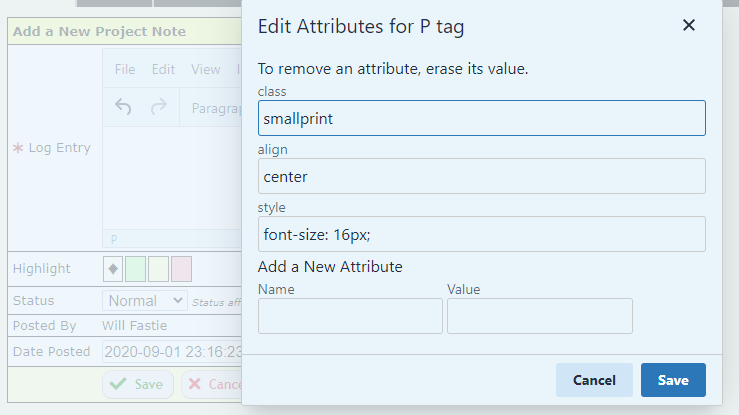

# tinymce-editattributes
A plugin allowing edition and addition of attributes for TinyMCE 5

This version of the plugin is NOT compatible with TinyMCE version 4 or earlier.
It is only compatible with TinyMCE 5.

How to install the plugin
=========================

1. Copy `editattributes` folder to the tinymce `plugins` folder.

2. Set up your instance in the tinyMCE.init method to use the plugin, like::

    plugins : "... editattributes ..."

3. Set up your instance to use the button, for example::

    toolbar : "... | editattributes"

Using the plugin
================

To remove an attribute, remove its value from the text input box.

To add a new attribute, enter the name and value in the input boxes.
Only one new attribute can be added at a time. To add another attribute,
invoke the tool again.

Note that TinyMCE will not allow some attributes to be added. For example,
adding the attribute "name" will not work. This is normal behavior. Such 
attributes can not be added using the Source Code feature, either.

The most valuable use of the Edit Attributes plugin is to add a new value
for the "class" attribute, which allows styling of an element outside classes
that TinyMCE already knows about. However, any attribute can be added as long
as it is not restricted by TinyMCE.

The original version of the plugin displayed all attributes. The plugin was forked
several years ago to prevent attributes beginning with "data-mce-" from being displayed.
Version 5 retains this behavior.
